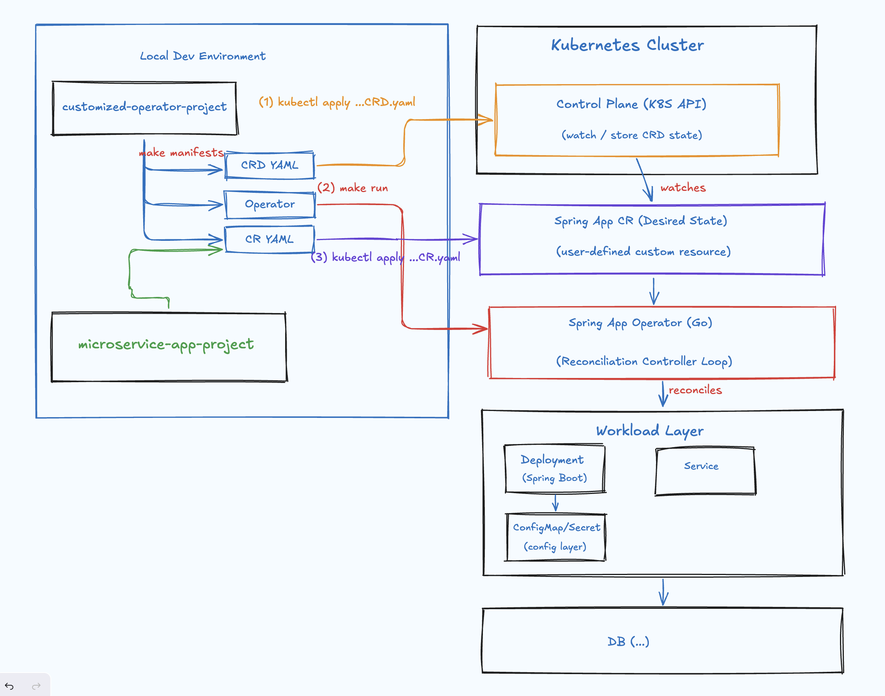

# spring-app-k8s-operator

A hands-on reference for building a **Kubernetes customized operator** around a minimal **Spring Boot** microservice (
with PostgreSQL CRUD as the demo workload).

Declare a `SpringApp` custom resource; the operator reconciles Deployment, Service, ConfigMap, database wiring, status,
and finalizers. No cloud provider required — runs entirely on localKubernetes (Kind).

## What's inside

| Component                          | Description                                                               |
|------------------------------------|---------------------------------------------------------------------------|
| [`notes-service/`](notes-service/) | Spring Boot 3 REST API — CRUD on `Note` entities backed by PostgreSQL     |
| [`operator/`](operator/)           | Go operator (Kubebuilder-style) — single `SpringAppReconciler` controller |

## Architecture



```
┌─────────────────┐     watches      ┌──────────────────────┐
│  SpringApp CR   │ ───────────────► │  SpringApp Operator  │
│  (desired state)│                  │  (1 controller)      │
└─────────────────┘                  └──────────┬───────────┘
                                                │ reconciles
                    ┌───────────────────────────┼───────────────────────────┐
                    ▼                           ▼                           ▼
             ┌────────────┐            ┌────────────┐            ┌────────────┐
             │ Deployment │            │  Service   │            │ ConfigMap  │
             │ (Spring)   │            │            │            │ + Secret   │
             └─────┬──────┘            └────────────┘            └────────────┘
                   │
                   ▼
             ┌────────────┐
             │ PostgreSQL │
             └────────────┘
```

## Prerequisites

| Tool                              | Version                                                  |
|-----------------------------------|----------------------------------------------------------|
| Java                              | 21+                                                      |
| Maven                             | 3.9+ (optional — Docker build works without local Maven) |
| Go                                | 1.23+                                                    |
| Docker                            | recent                                                   |
| kubectl                           | 1.28+                                                    |
| [kind](https://kind.sigs.k8s.io/) | 0.20+                                                    |

## Quick start

```bash
# 1. Create a local cluster
kind create cluster --name spring-notes

# 2. Build images
cd operator
make docker-build IMG=spring-notes-operator:dev
make docker-build-app APP_IMG=notes-service:dev

# 3. Load images into Kind
kind load docker-image spring-notes-operator:dev --name spring-notes
kind load docker-image notes-service:dev --name spring-notes

# 4. Install operator (CRD + RBAC + controller)
make install
make deploy IMG=spring-notes-operator:dev

# 5. Deploy Postgres + SpringApp CR
make demo-up

# 6. Watch reconciliation
kubectl get springapps -n demo -w
kubectl get deploy,svc,pod -n demo
```

Wait until `kubectl describe springapp notes-service -n demo` shows `Phase: Ready`.

## Verify the API

```bash
kubectl port-forward -n demo svc/notes-service 8080:8080

curl -s -X POST http://localhost:8080/api/notes \
  -H 'Content-Type: application/json' \
  -d '{"title":"hello","content":"from k8s operator"}' | jq

curl -s http://localhost:8080/api/notes | jq
curl -s http://localhost:8080/actuator/health | jq
```

## Local development

### Spring Boot (without Kubernetes)

```bash
docker run --rm -p 5432:5432 \
  -e POSTGRES_DB=notesdb \
  -e POSTGRES_USER=notes \
  -e POSTGRES_PASSWORD=notes \
  postgres:16-alpine

cd notes-service
mvn spring-boot:run
```

### Operator (against Kind)

```bash
cd operator
make run
# In another terminal:
kubectl apply -f deploy/demo/03-springapp.yaml
```

### Tests

```bash
cd operator
make test    # unit + envtest (Ginkgo)
make build   # compile manager binary
```

## Reconcile scenarios

| Scenario              | Controller behavior                                                    |
|-----------------------|------------------------------------------------------------------------|
| **Create**            | Adds finalizer; creates ConfigMap, Service, Deployment; updates status |
| **Image update**      | Patches Deployment template; triggers rolling rollout                  |
| **Config change**     | Updates ConfigMap checksum annotation; restarts pods                   |
| **Paused release**    | Skips Deployment mutations when `spec.release.paused=true`             |
| **DB secret missing** | Sets `Phase=Degraded`, `DatabaseReady=False`                           |
| **Delete**            | Finalizer path; removes finalizer; garbage-collects owned resources    |

## SpringApp CR example

```yaml
apiVersion: apps.example.com/v1alpha1
kind: SpringApp
metadata:
  name: notes-service
  namespace: demo
spec:
  image: notes-service:dev
  replicas: 1
  service:
    port: 8080
  database:
    provider: postgres
    host: postgres.demo.svc.cluster.local
    port: 5432
    name: notesdb
    credentialsSecretRef:
      name: notes-db-secret
  runtime:
    env:
      SPRING_PROFILES_ACTIVE: k8s
      APP_LOG_LEVEL: INFO
  release:
    paused: false
```

The operator injects:

- `SPRING_DATASOURCE_URL` from `database.host` / `port` / `name`
- `SPRING_DATASOURCE_USERNAME` / `PASSWORD` from Secret key refs
- ConfigMap mounted at `/config` (`application-k8s.properties`)

## Project layout

```
spring-app-k8s-operator/
├── notes-service/              # Spring Boot app
├── operator/
│   ├── api/v1alpha1/           # SpringApp CRD types
│   ├── internal/controller/    # Reconcile logic + tests
│   ├── config/                 # CRD, RBAC, manager manifests
│   └── deploy/demo/            # Postgres + SpringApp sample
└── README.md
```

## Cleanup

```bash
cd operator
make demo-down
make undeploy
make uninstall
kind delete cluster --name spring-notes
```

## Roadmap

- [ ] Helm chart (operator + app instance)
- [ ] Drift detection tests
- [ ] DB migration Job (`database.migrationMode=job`)
- [ ] GitHub Actions CI (unit tests + Kind e2e)

## License

[](../LICENSE)